# IN1020-Universe 🌌

## Summer Internship Project – 2025

This project was developed as part of my summer internship at the University of Oslo (UiO) in 2025. It is a digital learning platform designed for IN1020: Introduction to Computer Science, a first-year course at the Department of Informatics (IFI).

The platform presents a variety of interactive tasks, both single-player and multiplayer—that are intended to be solved individually or in groups. It also features an integrated AI-powered chatbot to support students by answering questions about the course content.

⸻

🚀 Tech Stack

Frontend:
	•	React
	•	TypeScript

Backend:
	•	Django (Python)
	•	PostgreSQL

Other technologies:
	•	Docker
	•	Kubernetes (deployed on UiO’s internal infrastructure)
	•	Azure OpenAI API 

⸻

🛠 Deployment

The application is containerized using Docker and deployed in a Kubernetes cluster hosted on the University of Oslo’s servers. Authentication is handled via UiO’s Weblogin 2.

----

⸻

📸 Screenshots

Here are some screenshots from the platform:

 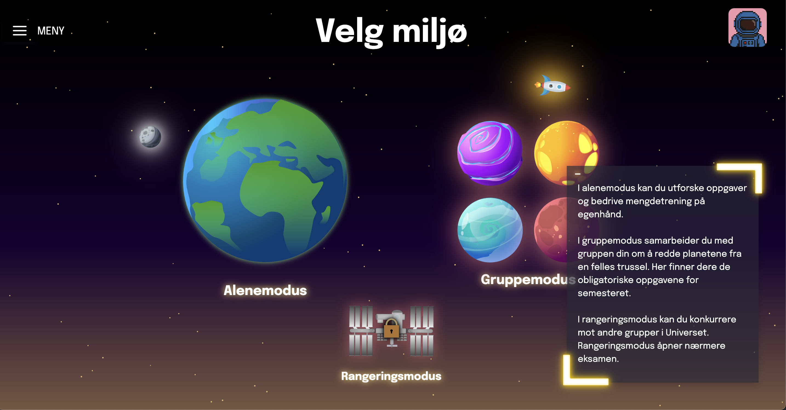 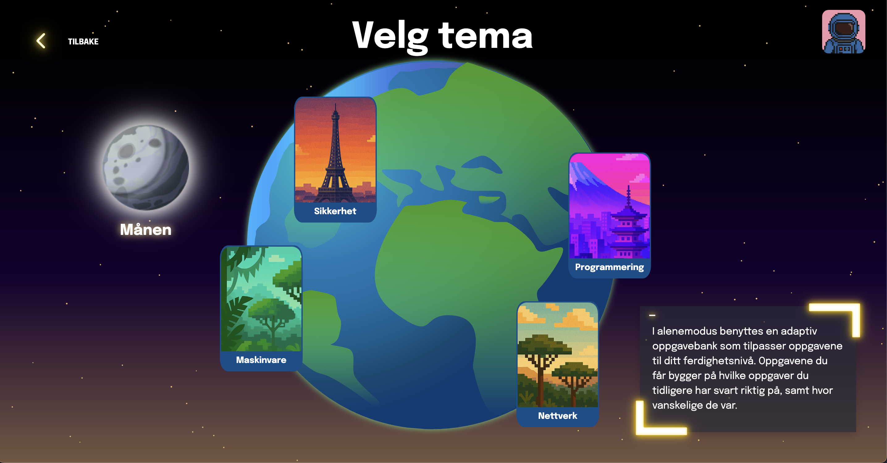 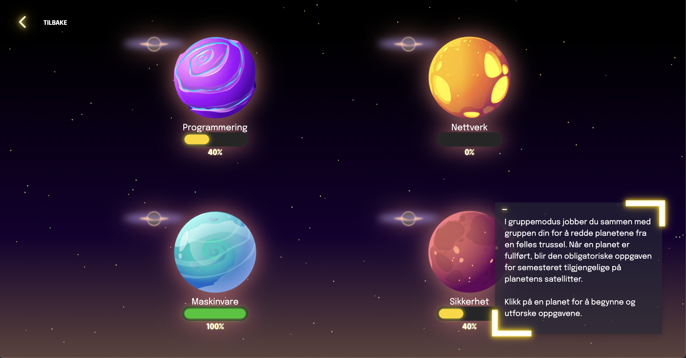 
	
 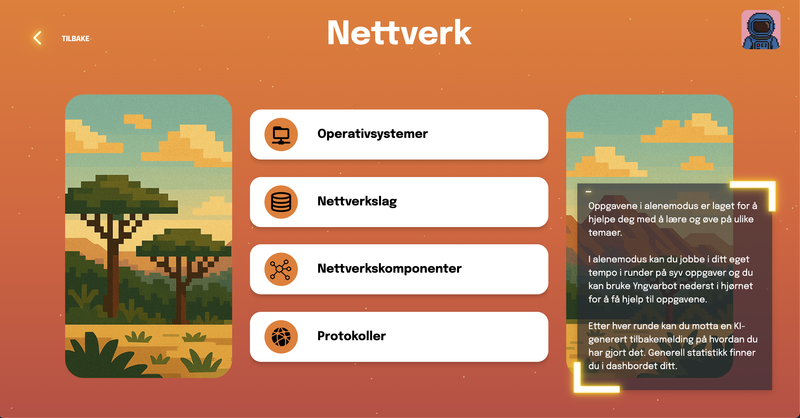 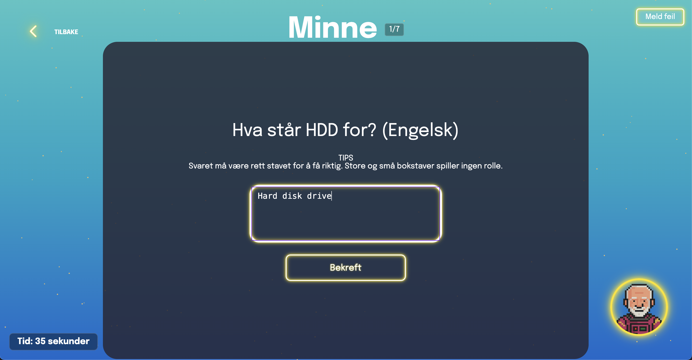 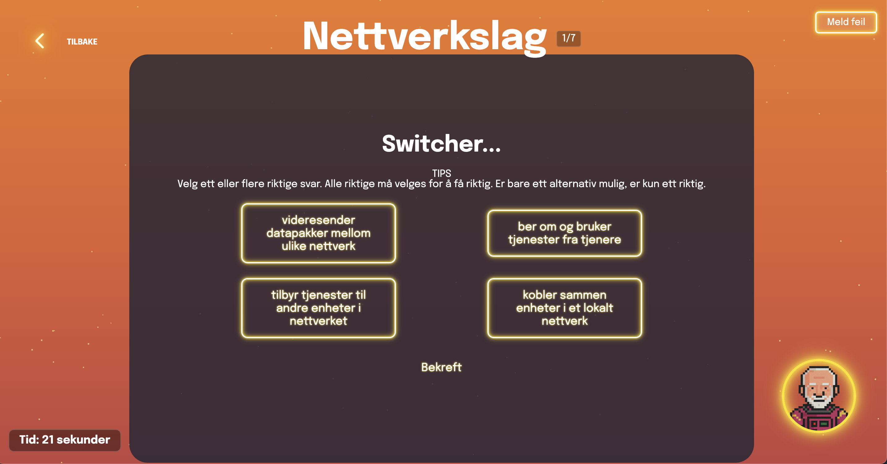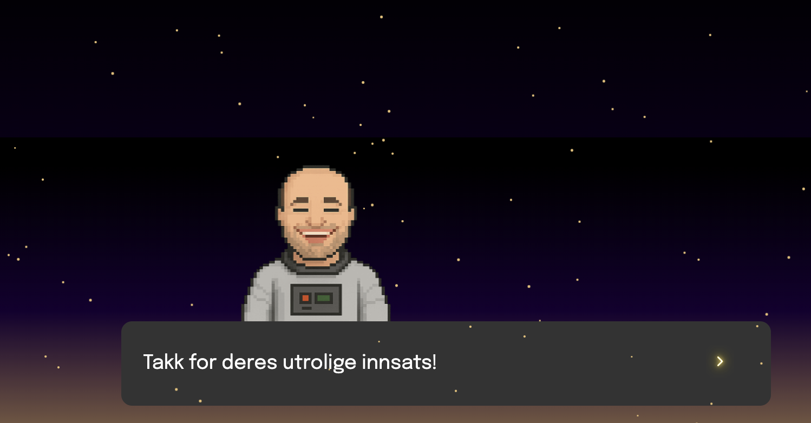

  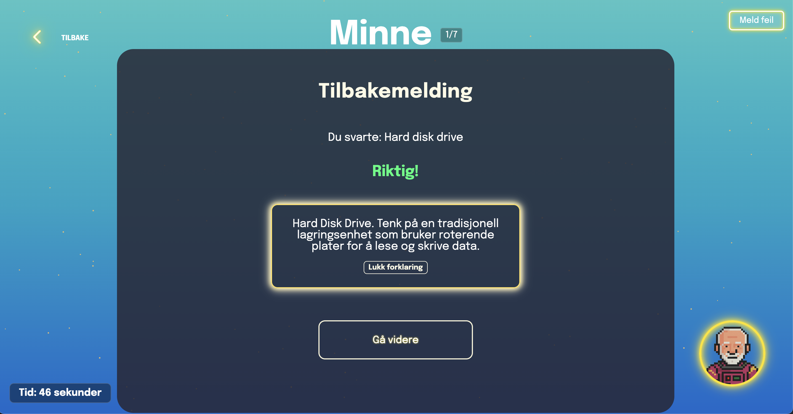 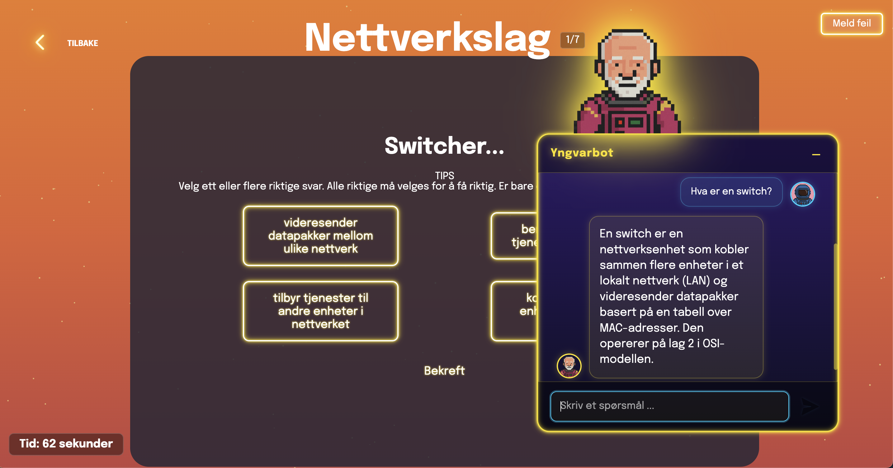 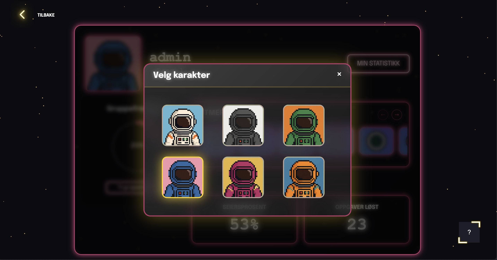

   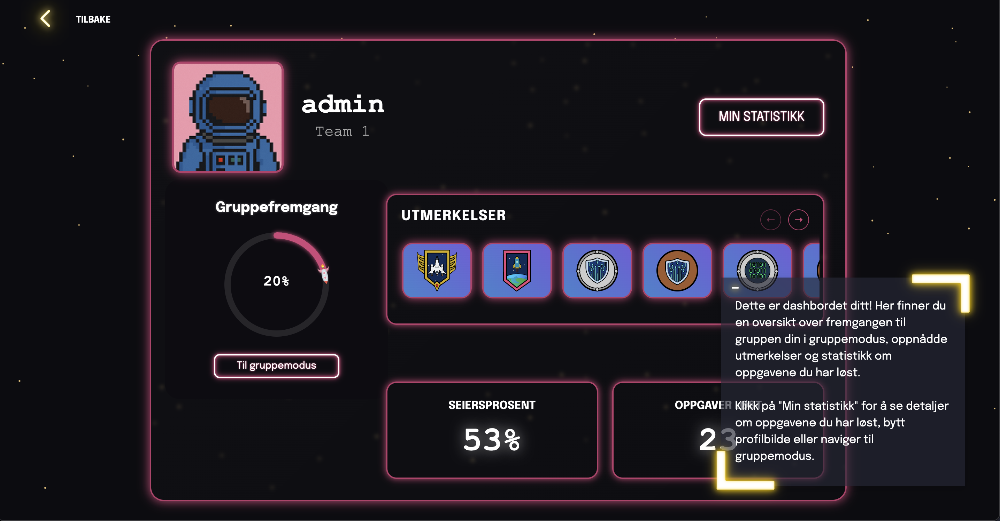 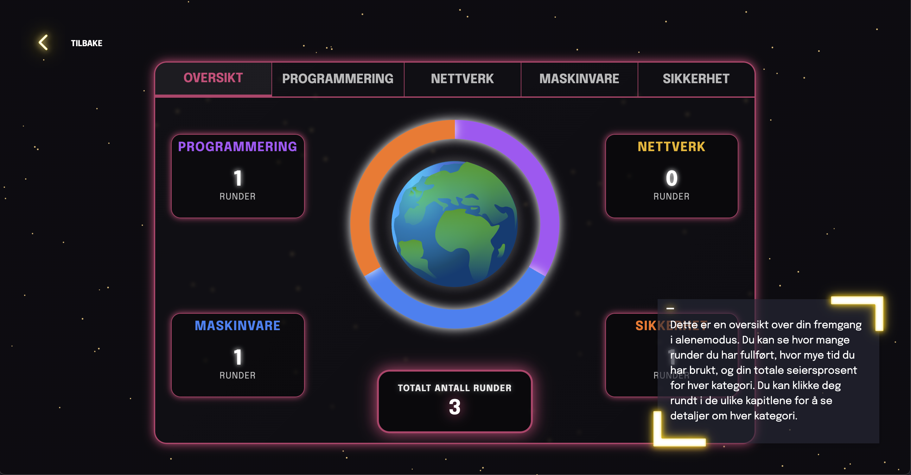 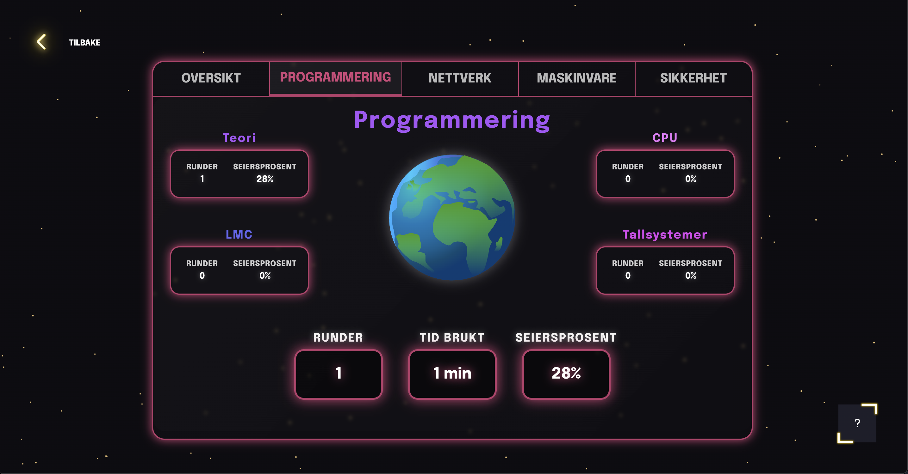 

